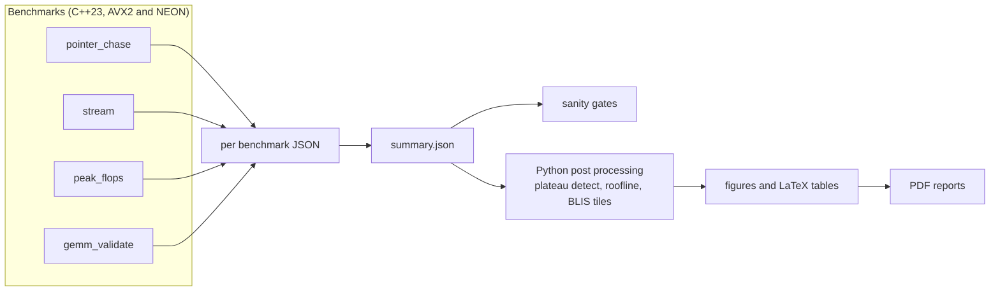
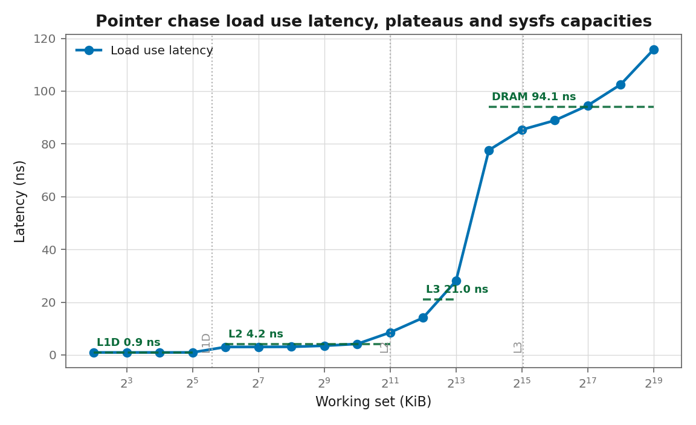
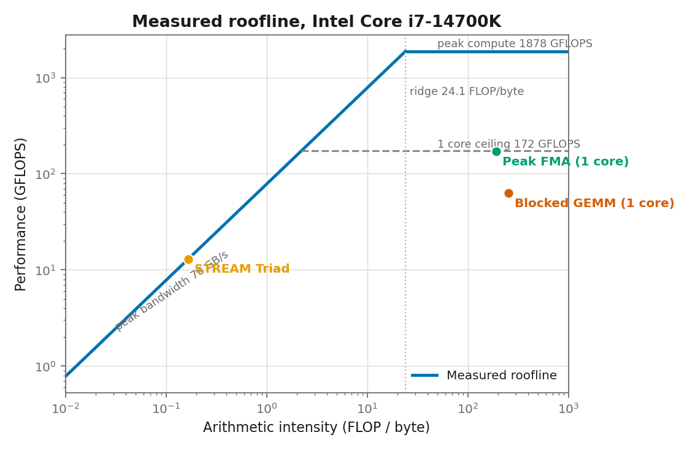
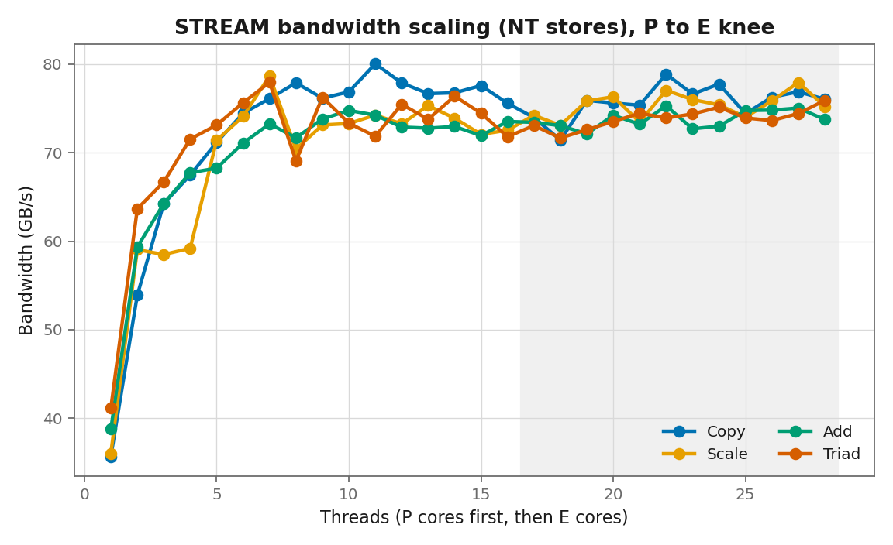
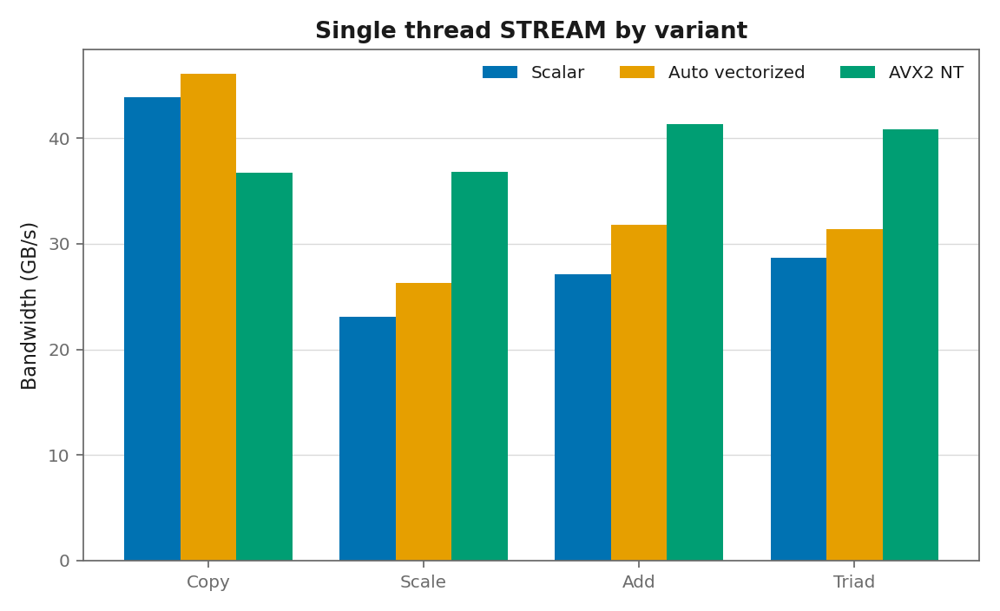

# CPU Microbenchmark Suite

[](https://github.com/Olajide-Badejo/CPU-Microbenchmark-Suite/actions/workflows/ci.yml)
[](LICENSE)
[](CMakeLists.txt)
[](scripts/)

**Measures what spec sheets only claim.** This suite measures, on real hardware,
the numbers usually taken from a data sheet: cache load use latencies, sustainable
memory bandwidth, and peak single precision floating point throughput. It then
assembles those measured ceilings into a roofline and uses the measured cache
capacities to predict blocked matrix multiply tile sizes, which a blocked GEMM
sweep validates.

Everything is measured on an Intel Core i7-14700K running inside WSL2. No number
is quoted from a data sheet, and every place the platform makes a number hard to
get right is stated openly rather than smoothed over.

Author: **Olajide Badejo**.

---

## Headline results

| Quantity | Measured | Cross check |
|---|---|---|
| L1D load use latency | 0.94 ns (5.0 cycles) | Raptor Cove L1 is 5 cycles |
| L2 latency | 16.3 cycles | Raptor Cove L2 is about 16 cycles |
| DRAM latency | 93 ns | DDR5 random access plus TLB walk |
| Sustained bandwidth | 78 GB/s | 87 percent of DDR5-5600 dual channel peak |
| Single P core peak SP | 169 GFLOPS | 99 percent of the ceiling from the measured clock |
| All core peak SP | 1915 GFLOPS | 28 logical CPUs |

## How it fits together

The benchmarks emit self describing JSON that is merged into a single
`summary.json`. Every figure, table, and report is regenerated from that one
file, so a plot can never disagree with a number.



## Results

### Cache latency plateaus

A prefetcher defeating single cycle pointer chase recovers the L1, L2, L3, and
DRAM plateaus. The detected boundaries are cross checked against the cache sizes
the operating system reports.



### Measured roofline

The measured ceilings assembled into a roofline. STREAM Triad sits on the memory
bound slope; the single core FMA loop sits on the single core ceiling; the naive
blocked GEMM sits below it, and that gap is the cost of not packing.



### Memory bandwidth

Bandwidth saturates at four to five threads, well before the cores are
exhausted, so the reported knee is the bandwidth wall rather than a P to E
transition. Single thread numbers show the non temporal store variant winning on
Add and Triad.





## Reports

Two PDF reports, both compiled through the build and viewable directly in GitHub:

- **[Main technical report](assets/reports/main_report.pdf)** : introduction,
  background, methodology, implementation, results, discussion, conclusion.
- **[Engineering debug report](assets/reports/debug_report.pdf)** : the seven
  debugging findings behind the clean results, each with symptom, root cause,
  fix, and verification.

## Measurement honesty

WSL2 exposes no hardware performance counters, so every number is derived from
timing and a known transfer size (the classical STREAM approach). Two platform
facts drove the design:

1. `/proc/cpuinfo` reports a fixed base clock near 3.42 GHz and never tracks the
   real boost frequency (about 5.3 GHz), and there is no cpufreq interface. The
   suite measures the running clock in software with a dependent add chain, and
   every cycle denominated figure uses that measured clock.
2. The hybrid performance and efficiency core split is invisible to the guest,
   so P and E identification falls back to the Intel enumeration and is flagged
   as heuristic, not measured.

Both are documented in [docs/methodology.md](docs/methodology.md) and
[docs/ENGINEERING_LOG.md](docs/ENGINEERING_LOG.md).

## What it measures

- **Pointer chase latency**: a random single cycle permutation at 64 byte
  stride, swept from 4 KB to 512 MB, with log space change point detection cross
  checked against sysfs.
- **STREAM bandwidth**: Copy, Scale, Add, and Triad in three variants (honest
  scalar, compiler vectorized, AVX2 with non temporal stores) plus a 1 to N
  thread scaling curve.
- **Peak FLOPS**: ten independent AVX2 FMA chains, single P core and all core,
  checked against the ceiling from the measured clock.
- **Roofline and tile prediction**: the measured ceilings assembled into a
  roofline, with a BLIS style analytical tile prediction validated against a
  blocked GEMM sweep.
- **AArch64 NEON port**: the FLOPS and STREAM kernels, correctness checked under
  qemu-user, with a native ARM CI workflow.

## Build and run

Inside WSL2 Ubuntu, or any Linux with GCC and CMake:

```sh
make build      # configure and compile all benchmarks and tests
make test       # unit and integration tests (about 5 seconds)
make suite      # full measurement suite (about 45 seconds on the target)
make plots      # regenerate figures and tables from summary.json
make report     # build the main report PDF
make all        # clean tree reproduction of everything
```

The AArch64 NEON self test under qemu:

```sh
make arm-selftest
```

## Repository layout

```text
include/     header only benchmark toolkit and kernels
src/         pointer_chase, stream, peak_flops, gemm_validate
tests/       unit and integration tests (C++ and Python)
scripts/     suite runner, post processing, plotting, style checks
report/      main report LaTeX, figures, tables
report_debug/ engineering debug report LaTeX
experiments/ committed canonical summary.json
.github/     x86 and native ARM CI workflows
```

## Toolchain

C++23 (g++ 15.2), CMake, Python 3 with numpy, scipy, matplotlib, and tqdm, a
cross toolchain with qemu-user for the AArch64 port, and TeX Live for the
reports. Link time optimization is forbidden for benchmark targets and the build
asserts it off, so the compiler cannot delete a loop being measured.

## License

Released under the [MIT License](LICENSE). Sole author, Olajide Badejo.
